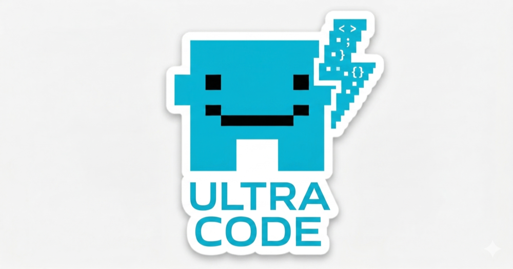
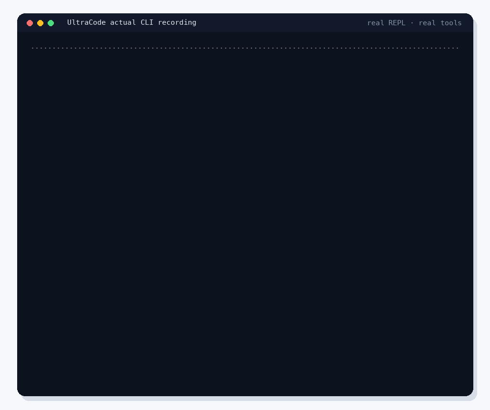
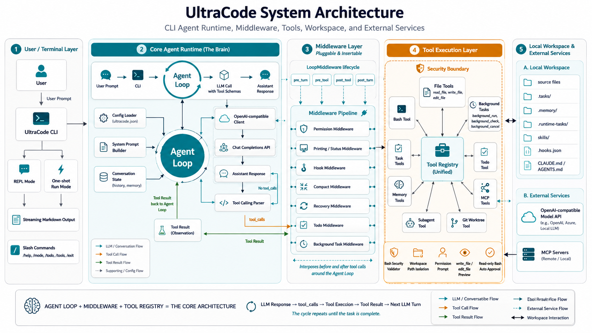

<p align="right">
English | <a href="README.zh-CN.md">简体中文</a>
</p>

<p align="center">
  
</p>

# UltraCode

UltraCode is a terminal-first coding agent for developers. It runs a multi-turn Agent loop on top of OpenAI-compatible Chat Completions APIs, connects the model to local tools through a unified registry, and keeps file writes, shell commands, context compaction, and background tasks under workspace-level control.

<p align="center">
  
</p>

## Quick View

| Item | Details |
|------|---------|
| Package | `ultracode` |
| Source layout | `src/aicode/` |
| Python | `>=3.11` |
| CLI commands | `ultracode`, `ultra`, `aicode` |
| Model API | OpenAI-compatible Chat Completions |
| Runtime model | Agent loop with tool calls |

## Why UltraCode

UltraCode is built for the part of AI coding that happens inside a real repository: reading files, editing code, running commands, keeping context, and asking for approval when an action can change the workspace. The interaction model follows the core Claude Code experience, while the backend can point to any OpenAI-compatible model service.

## Architecture

<p align="center">
  
</p>

The core architecture has three moving parts: the Agent loop, the middleware pipeline, and the tool registry.

```text
User prompt
  -> UltraCode CLI
  -> Agent loop
  -> Chat Completions API with tool schemas
  -> tool_calls
  -> middleware checks
  -> ToolRegistry dispatch
  -> local tool execution
  -> tool result
  -> next model turn
```

| Layer | Role |
|-------|------|
| Terminal layer | REPL mode, one-shot run mode, slash commands, streaming Markdown output. |
| Core runtime | Config loading, system prompt building, conversation state, model calls, tool-call parsing. |
| Middleware | Permission, hooks, compaction, recovery, todos, background notifications, and status printing. |
| Tool execution | File tools, Bash, task tools, memory tools, background tasks, MCP tools, subagents. |
| Workspace and services | Local repository files, `.tasks/`, `.memory/`, `.runtime-tasks/`, MCP servers, model APIs. |

## Features

| Capability | Details |
|------------|---------|
| Interactive sessions | Multi-turn REPL with session history and streaming assistant output. |
| One-shot runs | `ultracode run "..."` for scripts, quick checks, and automation. |
| Local tools | `read_file`, `write_file`, `edit_file`, `bash`, task tools, background tools, MCP tools, and subagents. |
| Permission modes | `default`, `plan`, and `auto`, with write/edit previews before approval. |
| Safer Bash | Bash validation, read-only auto approval, and workspace-aware command review. |
| Context handling | Memory files, project rules, transcript compaction, and recovery retries. |
| Terminal rendering | Tables, fenced code blocks, inline code, lists, quotes, and headings render cleanly in the CLI. |

## Installation

```bash
cd /path/to/Ultracode
pip install -e .
```

For development:

```bash
pip install -e ".[dev]"
```

Runtime dependencies are listed in [pyproject.toml](./pyproject.toml).

## Configuration

Create a `.env` file in the project or workspace, or provide the same values through environment variables. UltraCode loads `.env` without overwriting variables that are already set.

| Variable | Details |
|----------|---------|
| `LLM_API_KEY` or `OPENAI_API_KEY` | API key, required. |
| `LLM_MODEL` | Model name, required. |
| `LLM_BASE_URL` | OpenAI-compatible base URL. |
| `LLM_MAX_TOKENS` / `AICODE_MAX_TOKENS` | Max tokens per model turn, default `8000`. |
| `LLM_MAX_TURNS` / `AICODE_MAX_TURNS` | Max Agent loop turns, default `100`. |
| `AICODE_STREAM` | Stream assistant output in TTY mode, default on. |
| `AICODE_ENABLE_RECOVERY` | Enable recovery middleware. |
| `AICODE_RECOVERY_MAX_RETRIES` | Max recovery retries, default `3`. |
| `AICODE_COMPACT_AUTO_THRESHOLD` | Threshold for automatic context compaction. |
| `AICODE_BASH_TIMEOUT` | Bash tool timeout in seconds, default `120`. |
| `AICODE_AUTO_APPROVE_READONLY_BASH` | Auto-approve clearly read-only shell commands, default `1`. |
| `AICODE_MCP_CONFIG` | Path to an MCP JSON config file. |
| `AICODE_NO_WAIT_HINT` | Disable the non-streaming wait hint. |
| `AICODE_COLOR` | Force color on or off with `1` or `0`. |
| `NO_COLOR` | Disable ANSI colors when set. |

The workspace defaults to the current directory. Use `-C DIR` or `--cwd DIR` to choose another workspace.

## Usage

```bash
# Interactive mode
ultracode
ultracode repl
ultracode -C /path/to/project

# One-shot request
ultracode run "Summarize this repository structure"
ultracode run -v "Inspect the codebase and suggest the next cleanup step"

# Read a prompt from stdin
echo "Summarize main.py" | ultracode run -

# Commands that do not require an API key
ultracode tasks
ultracode worktrees

ultracode --version
```

## REPL Commands

| Command | Action |
|---------|--------|
| `/help` | Show help. |
| `/todo` | Show session todos. |
| `/tasks` | Show persistent tasks. |
| `/tools` | List registered tools. |
| `/mcp` | Show MCP status. |
| `/memories` | Show loaded memories. |
| `/mode default\|plan\|auto` | Change permission mode. |
| `/rules` | Show permission rules. |
| `/clear` | Clear session history. |
| `/exit` | Quit. |

## Workspace Files

| Path | Purpose |
|------|---------|
| `.tasks/` | Persistent task graph. |
| `.memory/` | Markdown memories, including `MEMORY.md`. |
| `.runtime-tasks/` | Background task state and logs. |
| `skills/` | Subagent templates with `SKILL.md`. |
| `CLAUDE.md` / `AGENTS.md` | Project rules injected into the system prompt. |
| `.hooks.json` | Hook definitions, guarded by workspace trust. |

## Extending

| Extension point | How to add it |
|-----------------|---------------|
| New tool | Register a handler and schema with `ToolRegistry.register(...)`. |
| New middleware | Implement the `LoopMiddleware` methods used by the Agent loop. |
| MCP tools | Add MCP server config and expose tools through the `mcp__*` naming pattern. |
| Subagent skill | Add a `SKILL.md` template under `skills/`. |

## Technical Report

Read the full architecture notes in [TECHNICAL_REPORT.md](./TECHNICAL_REPORT.md).

## Development

```bash
pip install -e ".[dev]"
python -m pytest tests/ -q
```

## Notes

| Topic | Details |
|-------|---------|
| GUI apps and games | The `bash` tool waits for commands to finish. Use `background_run` for long-running or windowed programs, or run them manually in a local terminal. |
| Safety | In `default` mode, review permission prompts before allowing writes or command execution. `write_file` and `edit_file` show previews before changes are applied. |
