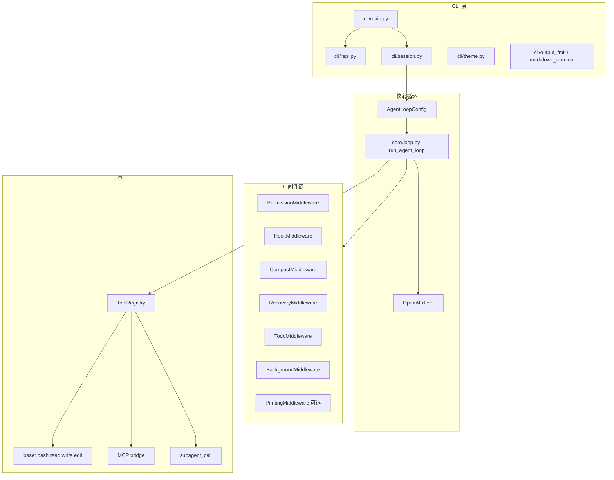

# UltraCode（aicode）技术报告

**版本**：0.1.0（以 `pyproject.toml` 为准）
**文档目的**：说明代码结构、运行时数据流、扩展方式与关键设计取舍，便于维护与二次开发。

---

## 1. 概述与设计目标

UltraCode 是一个 **单进程 CLI 应用**，通过 **OpenAI Chat Completions API**（含 `tools` / `tool_choice=auto`）驱动多轮 Agent 循环。设计目标包括：

1. **与 Claude Code 类似的使用体验**：工作区根目录、工具调用、系统提示可叠加项目规则与记忆。
2. **可组合的中间件**：权限、钩子、压缩、待办、后台任务等以 **同一套 LoopMiddleware 协议** 接入，避免多套独立循环。
3. **可替换后端**：任意兼容 OpenAI SDK 的 `base_url` + 模型名。
4. **安全默认值**：路径限制在 workdir、bash 黑名单与校验、交互式确认与 **写文件前内容预览**。

---

## 2. 总体架构

**一次用户轮询的简化顺序**：

1. 各中间件 `pre_turn`
2. 组装 `[system, …messages]`，调用 LLM（可选流式、可选 recovery 重试）
3. 若返回 `tool_calls`：对每个调用依次 `pre_tool`（可拦截）→ `registry.dispatch` → `post_tool`
4. 将 tool 消息追加到 `state.messages`，`turn_count` 递增（有工具时）
5. 各中间件 `post_turn`
6. 直到无工具调用或达到 `max_turns`

类型契约见 **`core/types.py`**：`LoopState`、`ToolCall`、`ToolResult`、OpenAI 风格的 `Message` dict。

---

## 3. 目录与模块映射

| 路径 | 职责 |
|------|------|
| `aicode/cli/` | 入口、REPL、会话组装、主题色、输出格式化入口 |
| `aicode/core/` | 配置、客户端、主循环、工具实现与注册、等待提示、LLM 流式类型、终端 Markdown 管线 |
| `aicode/prompt/` | `SystemPromptBuilder` 与各段落（core、工具列表、技能、记忆、CLAUDE/AGENTS、动态上下文） |
| `aicode/security/` | 权限决策、bash 校验、工作区信任 |
| `aicode/hooks/` | `.hooks.json` 加载与执行、HookMiddleware |
| `aicode/background/` | 后台进程管理、通知队列、工具注册与 Middleware |
| `aicode/planning/` | 任务图（`.tasks`）、Todo 计划与中间件 |
| `aicode/memory/` | 记忆加载/保存、可选 Dream 巩固门控 |
| `aicode/context/` | 压缩策略、transcript、CompactMiddleware |
| `aicode/recovery/` | Recovery 配置、策略、RecoveryMiddleware |
| `aicode/mcp/` | 连接 MCP、路由、桥接到 ToolRegistry |
| `aicode/subagent/` | 子 Agent 循环隔离、`spawn_subagent`、模板 |
| `aicode/worktrees/` | git worktree 列表工具 |
| `tests/` | phase1/phase2 分阶段测试与 `conftest` mock LLM |

---

## 4. Agent 主循环（`core/loop.py`）

### 4.1 `AgentLoopConfig`

数据类聚合：**OpenAI 客户端**、**model**、**ToolRegistry**、**system_prompt_fn**、**middleware 列表**、`max_turns` / `max_tokens`、可选 **`recovery`**、**`stream`**、**`stream_writer`**、**`stream_line_prefix`**（TTY 下边栏样式）。

### 4.2 LLM 调用路径

- **非流式**：`chat.completions.create`，解析为 **`LLMCallResult`**（`assistant_dict`、`tool_calls`、`finish_reason`）。
- **流式**：`stream=True`，累积 `delta.content` 与 `delta.tool_calls`（按 index 合并），统一为与阻塞模式一致的结构。
- **Recovery 开启时**：强制非流式，便于对 `prompt_too_long`、连接错误做压缩与退避重试。
- **流式 + 默认 stdout**：可叠加 **`AssistantMarkdownStreamWriter`**（行内 `**`、围栏、按行标题/列表）与 **`_PrefixedLineWriter`**（左侧青色竖条）。

### 4.3 `llm_wait_context`

在 **非流式** 时于 stderr 显示等待动画；**流式** 时关闭，避免与 stdout 交错乱码。

---

## 5. 工具系统（`core/tools/`）

- **`registry.py`**：`ToolRegistry` 注册 name → handler + JSON schema；`build_base_registry(workdir)` 绑定工作目录。
- **`base.py`**：`safe_path` 防止逃逸；`run_bash` 使用 `subprocess.run(shell=True)`，超时来自 **`AICODE_BASH_TIMEOUT`**；`run_read` / `run_write` / `run_edit`。
- **`schemas.py`**：OpenAI function 格式的 schema 定义。
- 会话层在 `session.build_repl_context` 中继续注册 todo、task、background、MCP、worktree、subagent 等。

工具返回统一为字符串，经 **`ToolResult.to_message()`** 写入对话历史。

---

## 6. CLI 与会话（`cli/session.py`）

**`build_repl_context`** 完成：

1. `get_config()` + `get_client()`
2. 构建 registry 并注册各类工具
3. `SystemPromptBuilder`（workdir、registry、memory、skills）
4. `PermissionManager` + `HookManager` + `CompactMiddleware` + 可选 `RecoveryMiddleware` + `TodoMiddleware` + `BackgroundMiddleware`
5. 可选 **`PrintingMiddleware`**（工具结果一行摘要）
6. **`AgentLoopConfig`**（含 `stream` 与 `stream_line_prefix`）

**`run_agent_turn`**：单次 `run_agent_loop`，返回 `(最后助手文本, 是否已在流式中输出)`，供 `run` 子命令避免重复整段打印。

---

## 7. 终端呈现（`core/markdown_terminal.py` + `cli/theme.py`）

- **批处理**：`format_assistant_markdown` 在代码围栏外对片段做：GFM 表格列对齐、ATX 标题、列表、引用、`**粗体**`。
- **流式**：增量状态机 + flush 时整段兜底。
- **REPL**：`theme.repl_prompt()` 与助手块左侧 **`┃`** 条一致色系。

---

## 8. 安全与权限（`security/`）

- **`validator.py`**：`BashSecurityValidator` 对命令做正则扫描（sudo、rm -rf 模式、元字符、命令替换等），严重级直接 deny，警示级倾向 ask。
- **`permission.py`**：`PermissionManager.check` → allow / deny / ask；**`ask_user`** 对 **`write_file` / `edit_file`** 打印 **正文预览**（行数/字节上限与截断说明）后再询问。
- **`trust.py`**：钩子是否执行依赖工作区信任文件（或 sdk 模式）。

---

## 9. 扩展点摘要

| 扩展 | 机制 |
|------|------|
| 新工具 | `registry.register(name, handler, schema)`，在 `build_repl_context` 或自定义入口中调用 |
| 新中间件 | 实现 `LoopMiddleware`，加入 `AgentLoopConfig.middleware` |
| MCP | `mcp/loader` 连接 + `register_mcp_tools` |
| 子代理 | `subagent/runner.spawn_subagent`，通常 **`stream=False`** |
| 恢复 | `AICODE_ENABLE_RECOVERY` + `RecoveryConfig` |
| 记忆 | `.memory/*.md` 与 `MemoryManager` |
| 钩子 | `.hooks.json`，事件见 `hooks/events.py` |

---

## 10. 测试与工程配置

- **pytest**：`tests/phase1`（循环、工具、配置、todo、任务图、wait_hint）、`tests/phase2`（权限、压缩、钩子、MCP、memory、prompt、background）。
- **`pyproject.toml`** 中 **`[tool.pytest.ini_options]`** 禁用易联网卡死的全局插件（如 `langsmith_plugin`、`asyncio`），避免本地环境拖慢测试。
- **`conftest.py`**：`mock_llm` 支持流式 chunk；可设置 **`AICODE_BASH_TIMEOUT`** 缩短 bash 测试等待。

---

## 11. 已知限制与建议

1. **`bash` 同步阻塞**：不适合长时间服务或 GUI；应使用 **`background_run`** 或用户本机终端。
2. **终端 Markdown**：非完整 CommonMark；复杂表格/嵌套列表可能表现不完美。
3. **CJK 列宽**：表格对齐基于 Python `len()`，双宽字符在部分字体下可能略有偏差。
4. **子进程与 Windows**：编码、杀毒软件可能影响 `bash` 耗时或偶发阻塞。

---

## 12. 版本与维护

- 以 **`pyproject.toml`** 的 `version` 与 `dependencies` 为准。
- 架构变更时请同步更新本报告与 **README.md** 中的「功能概览 / 配置表 / 目录说明」。
